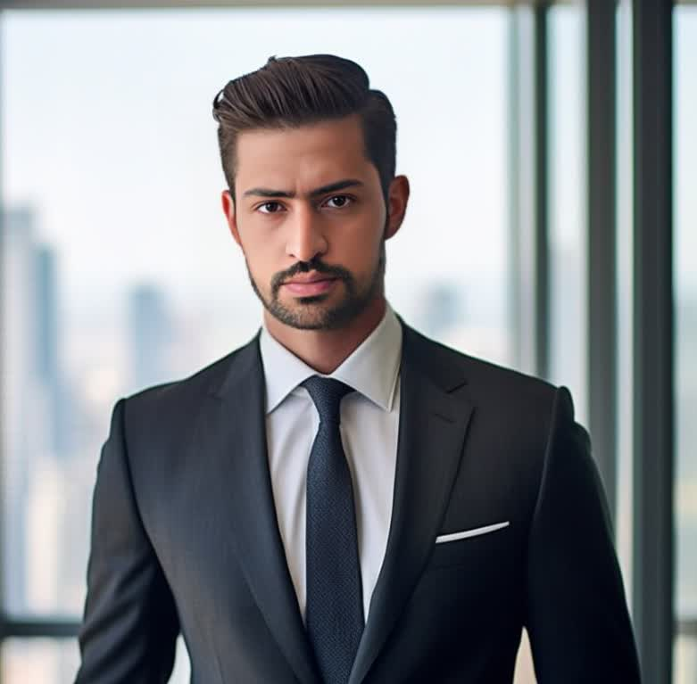
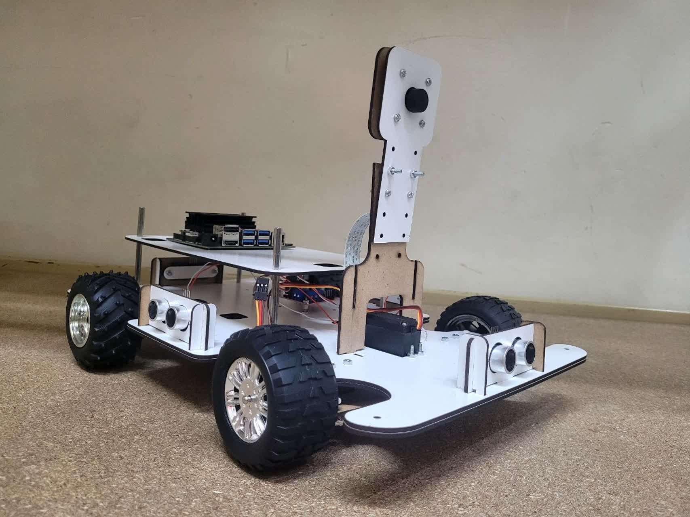

<html lang="en">
<head>
    <meta charset="UTF-8">
    <meta name="viewport" content="width=device-width, initial-scale=1.0, maximum-scale=1.0, user-scalable=no">
    <title>Electronics & Programming Portfolio</title>
    <link rel="stylesheet" href="https://cdnjs.cloudflare.com/ajax/libs/font-awesome/6.0.0/css/all.min.css">
    
</head>
<body>
    <nav class="nav">
        <ul>
            <li><a href="#home">Home</a></li>
            <li><a href="#projects">Projects</a></li>
            <li><a href="#skills">Skills</a></li>
            <li><a href="#contact">Contact</a></li>
        </ul>
    </nav>

    <section id="home" class="hero">
        

            
            <h1>Ramin Azizy</h1>
            
Mechatronics Engineer | Embedded Hardware Developer

            
"Turning electronic ideas into smart solutions"

        

    </section>

    <section class="about-section">
        <h2>ABOUT ME</h2>
        
As a Mechatronics Engineer specializing in microcontroller programming, I’ve spent 2+ years collaborating freelance with IoT startups and tech companies. My expertise lies in developing embedded systems and integrating sensors with platforms like Arduino, ARM, Raspberry Pi, and Jetson Nano.

        <h3>Key Skills:</h3>
        <ul>
            <li>Advanced Python & C++ programming</li>
            <li>Environmental/industrial sensor deployment</li>
            <li>Full-stack IoT development</li>
            <li>Custom PCB design for robotic applications</li>
        </ul>

        <h3>Education & Awards</h3>
        <ul>
            <li>M.Sc. in Mechatronics, Shahid Beheshti University</li>
            <li>2nd Place, Nowshirvani Babol Robotics Competition</li>
            <li>Industrial automation projects</li>
        </ul>

        

            
I’m deeply passionate about cutting-edge robotics and spend my free time building open-source projects focused on AI-driven low-power hardware.

        

    </section>

    <section id="projects" class="projects">
        <h2>Featured Projects</h2>
        

            

                
                

                    <h3>Smart Home Automation</h3>
                    
The AI-Powered Autonomous Vehicle with Computer Vision project implements cutting-edge embedded technologies. Utilizing an NVIDIA Jetson Nano (Linux OS) paired with an HD camera, the system achieves 30 FPS real-time obstacle detection through Convolutional Neural Network (CNN) algorithms. Precision-controlled 12V DC motors and servos (±0.5° accuracy) are integrated with IoT protocols like MQTT/WebSocket for instantaneous data transmission. A GPS navigation module (1.5m accuracy) enables dynamic path planning by fusing visual data with geospatial coordinates. The web-based interface allows seamless switching between manual/autonomous modes, while a 20000mAh Li-ion battery ensures extended operational efficiency.

                    <ul>
                        <li>Real-time sensor monitoring</li>
                        <li>Mobile app control</li>
                        <li>Energy optimization</li>
                    </ul>
                

            

            <!-- Add more project cards -->
        

    </section>

    <section id="projects" class="projects">
        <h2>Featured Projects</h2>
        

            

                
                

                    <h3>Smart Home Automation</h3>
                    
The AI-Powered Autonomous Vehicle with Computer Vision project implements cutting-edge embedded technologies. Utilizing an NVIDIA Jetson Nano (Linux OS) paired with an HD camera, the system achieves 30 FPS real-time obstacle detection through Convolutional Neural Network (CNN) algorithms. Precision-controlled 12V DC motors and servos (±0.5° accuracy) are integrated with IoT protocols like MQTT/WebSocket for instantaneous data transmission. A GPS navigation module (1.5m accuracy) enables dynamic path planning by fusing visual data with geospatial coordinates. The web-based interface allows seamless switching between manual/autonomous modes, while a 20000mAh Li-ion battery ensures extended operational efficiency.

                    <ul>
                        <li>Real-time sensor monitoring</li>
                        <li>Mobile app control</li>
                        <li>Energy optimization</li>
                    </ul>
                

            

            <!-- Add more project cards -->
        

    </section>
    <section id="skills" class="skills">
        <h2>Technical Skills</h2>
        

            <i class="fas fa-microchip skill-icon"></i>
            <i class="fas fa-code skill-icon"></i>
            <i class="fas fa-robot skill-icon"></i>
            <i class="fab fa-python skill-icon"></i>
        

    </section>

    <footer id="contact">
        
Contact: example@email.com

        
© 2025 All rights reserved

    </footer>

    
</body>
</html>
