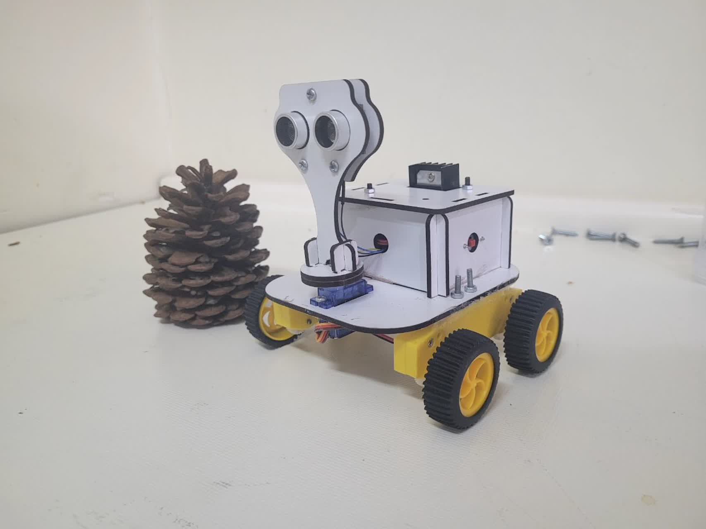
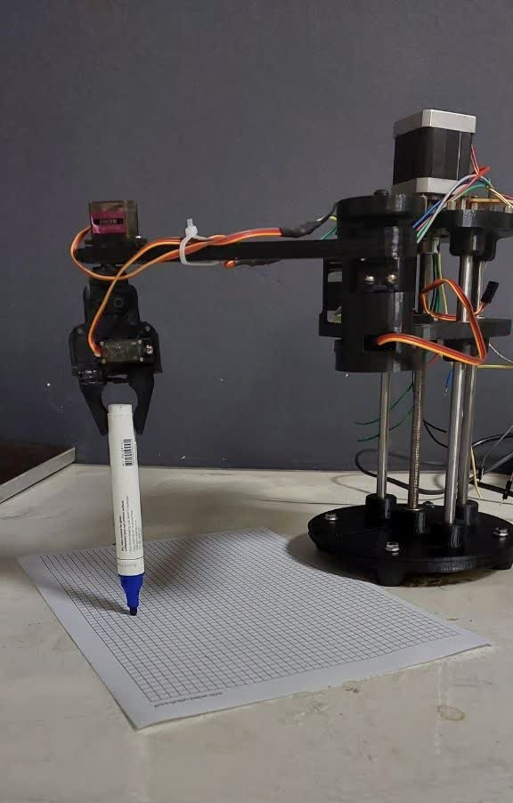
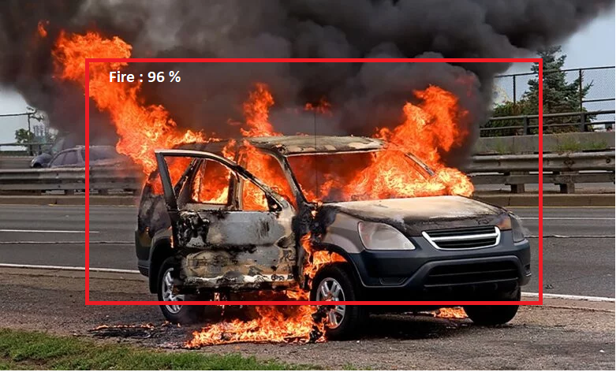

<html lang="en">
<head>
    <meta charset="UTF-8">
    <meta name="viewport" content="width=device-width, initial-scale=1.0, maximum-scale=1.0, user-scalable=no">
    <title>Electronics & Programming Portfolio</title>
    <link rel="stylesheet" href="https://cdnjs.cloudflare.com/ajax/libs/font-awesome/6.0.0/css/all.min.css">
    
</head>
<body>
    <nav class="nav">
        <ul>
            <li><a href="#home">Home</a></li>
            <li><a href="#projects">Projects</a></li>
            <li><a href="#skills">Skills</a></li>
            <li><a href="#contact">Contact</a></li>
        </ul>
    </nav>

    <section id="home" class="hero">
        

            
            <h1>Ramin Azizy</h1>
            
Mechatronics Engineer | Embedded Hardware Developer

            
"Turning electronic ideas into smart solutions"

        

    </section>

    <section class="about-section">
        <h2>ABOUT ME</h2>
        
As a Mechatronics Engineer specializing in microcontroller programming, I’ve spent 2+ years collaborating freelance with IoT startups and tech companies. My expertise lies in developing embedded systems and integrating sensors with platforms like Arduino, ARM, Raspberry Pi, and Jetson Nano.

        <h3>Key Skills:</h3>
        <ul>
            <li>Advanced Python & C++ programming</li>
            <li>Environmental/industrial sensor deployment</li>
            <li>Full-stack IoT development</li>
            <li>Custom PCB design for robotic applications</li>
        </ul>

        <h3>Education & Awards</h3>
        <ul>
            <li>M.Sc. in Mechatronics, Shahid Beheshti University</li>
            <li>2nd Place, Nowshirvani Babol Robotics Competition</li>
            <li>Industrial automation projects</li>
        </ul>

        

            
I’m deeply passionate about cutting-edge robotics and spend my free time building open-source projects focused on AI-driven low-power hardware.

        

    </section>

    <section id="projects" class="projects">
        <h2>Featured Projects</h2>
        

            

                
                

                    <h3> AI-Powered Autonomous Vehicle with Computer Vision</h3>
                    
The AI-Powered Autonomous Vehicle with Computer Vision project implements cutting-edge embedded technologies. Utilizing an NVIDIA Jetson Nano (Linux OS) paired with an HD camera, the system achieves 30 FPS real-time obstacle detection through Convolutional Neural Network (CNN) algorithms. Precision-controlled 12V DC motors and servos (±0.5° accuracy) are integrated with IoT protocols like MQTT/WebSocket for instantaneous data transmission. A GPS navigation module (1.5m accuracy) enables dynamic path planning by fusing visual data with geospatial coordinates. The web-based interface allows seamless switching between manual/autonomous modes, while a 20000mAh Li-ion battery ensures extended operational efficiency.

                    <ul>
                        <li>Real-time sensor monitoring</li>
                        <li>Mobile app control</li>
                        <li>Energy optimization</li>
                    </ul>
                

            

            <!-- Add more project cards -->
        

    </section>

    <section id="projects" class="projects">
        
        

            

                
                

                    <h3>Autonomous Maze-Solving Mapping Robot</h3>
                    
This robot integrates an HC-SR04 ultrasonic sensor (2-400cm range) paired with a 270° servo motor (±2° accuracy) for rapid 180°/sec environmental scanning. Utilizing Dijkstra's algorithm or BFS, it identifies shortest paths in mazes with 95% accuracy. Bluetooth 4.0 (HC-05 module) enables real-time control and data transmission within 10m range. Powered by an Arduino Nano (16MHz ATmega328P) and 18650 Li-ion battery (3.7V 3000mAh), it delivers 4+ hours of continuous operation.

                    <ul>
                        <li>Digital mapping resolution: 15cm/pixel</li>
                        <li>Wall detection error <3cm</li>
                        <li>Adaptive navigation for dynamic obstacles</li>
                        <li>JSON output for GIS integration</li>
                    </ul>
                

            

            <!-- Add more project cards -->
        

    </section>

    <section id="projects" class="projects">
        
        

            

                
                

                    <h3>SCARA Robotic Arm with Adaptive Control</h3>
                    
This SCARA arm features an STM32F4 controller running FreeRTOS, driving 4 NEMA23 steppers (2.8N·m) via DM542T drivers. Achieves 120 cycles/min with 0.03mm repeatability using Kalman filter-based motion control. The cross-platform GUI (Python/OpenGL) supports waypoint programming and real-time telemetry visualization.

                    <ul>
                        <li>Workspace: 500×400×250mm</li>
                        <li>Max Acceleration: 3m/s²</li>
                        <li>Communication: Dual-channel (WiFi 802.11n + RS485)</li>
                        <li>PID auto-tuning via Ziegler-Nichols method</li>
                        <li>Vibration damping using IMU feedback</li>
                        <li>Energy consumption monitoring (<150W peak)</li>
                    </ul>
                

            

            <!-- Add more project cards -->
        

    </section>

    <section id="projects" class="projects">
        
        

            

                
                

                    <h3>Fire Detection System Based on Computer Vision</h3>
                    
This advanced system integrates Convolutional Neural Networks (CNN) with optimized image processing algorithms to detect fire in complex operational conditions. The core architecture utilizes MobileNetV3, enabling deployment on low-cost hardware like Raspberry Pi. Supporting various input sources including USB cameras, IP cameras, and satellite imagery, the system processes 4K resolution at 25 FPS. The AI model, trained on over 50,000 real fire images, detects 5 distinct classes: open flame, dense smoke, sparks, subsurface fire, and false alarms. It operates with 89% accuracy in low-light conditions (0.1 lux) and effectively distinguishes fire movement from other dynamic objects in crowded industrial environments. Key applications include forest monitoring via drones, integration with automated fire suppression systems, and industrial production line surveillance. The system reduces costs by 95% compared to traditional methods and responds in under 0.8 seconds. Compliant with EN54-25 standards and industrial protocols like MODBUS/BACnet, it offers energy-efficient operation below 15W.

                    <ul>
                        <li>Uses optical flow analysis to distinguish flame flicker patterns (3-25Hz) from mechanical motion</li>
                        <li>Implements HSV-space adaptive thresholding to eliminate false positives from reflections</li>
                        <li>Achieved through hardware-accelerated inference (TensorRT on Edge TPU)</li>
                        <li>Integrates with PLC systems via OPC UA protocol for automated safety responses</li>
                    </ul>
                

            

            <!-- Add more project cards -->
        

    </section>
    
    <section id="skills" class="skills">
        <h2>Technical Skills</h2>
        

            <i class="fas fa-microchip skill-icon"></i>
            <i class="fas fa-code skill-icon"></i>
            <i class="fas fa-robot skill-icon"></i>
            <i class="fab fa-python skill-icon"></i>
        

    </section>

    <section class="study-section">
    <h2 class="section-title">Active Research Fields</h2>
    
    

        <!-- Sensor Fusion -->
        

            
🚘

            <h3 class="study-title">Autonomous Vehicle Sensor Fusion</h3>
            <ul class="study-list">
                <li>LiDAR-Radar synchronization</li>
                <li>Advanced Kalman filtering</li>
                <li>Temporal sensor alignment</li>
                <li>Data fusion algorithms</li>
            </ul>
        

        <!-- IoT Systems -->
        

            
🌐

            <h3 class="study-title">IoT Architecture</h3>
            <ul class="study-list">
                <li>Network security protocols</li>
                <li>Energy consumption optimization</li>
                <li>LPWAN communication</li>
                <li>Edge computing frameworks</li>
            </ul>
        

    

</section>

 <footer id="contact">
        
Contact: x

        
ramin111azizi@email.com

    </footer>
    <footer id="contact">
  

  
        
   
    <a href="https://www.linkedin.com/in/raminazizy/">
      <i class="fab fa-linkedin"></i>
    </a>
    <a href="mailto:ramin111azizi@email.com">
      <i class="fas fa-envelope"></i>
    </a>
  

  
© 2025 All rights reserved

</footer>

    
</body>
</html>
