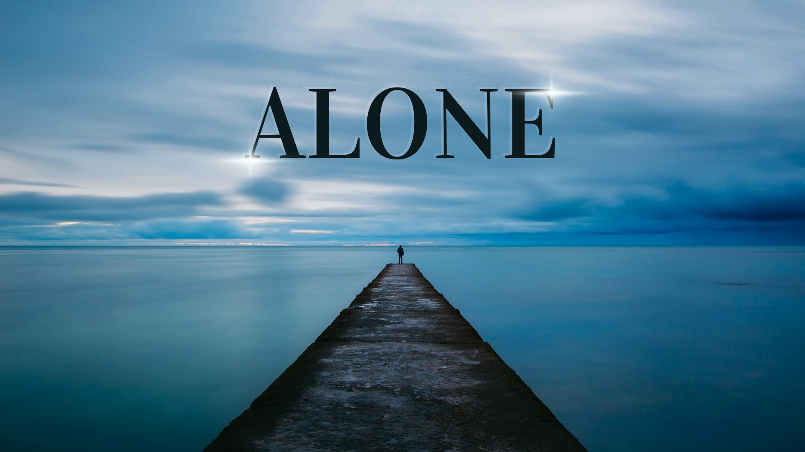

<!DOCTYPE html>
<html lang="en">
<head>
    <meta charset="UTF-8">
    <meta name="viewport" content="width=device-width, initial-scale=1.0">
    <title>Electronics & Programming Portfolio</title>
    <link rel="stylesheet" href="https://cdnjs.cloudflare.com/ajax/libs/font-awesome/6.0.0/css/all.min.css">
    
</head>
<body>
    <nav class="nav">
        <ul>
            <li><a href="#home">Home</a></li>
            <li><a href="#projects">Projects</a></li>
            <li><a href="#skills">Skills</a></li>
            <li><a href="#contact">Contact</a></li>
        </ul>
    </nav>

    <section id="home" class="hero">
        

            
            <h1>Ramin Azizy</h1>
            
Mechatronics Engineer | Embedded Hardware Developer

            
"Turning electronic ideas into smart solutions"

        

    </section>

    <section id="home" class="hero">
        

            
            <h1>ABOUT ME                                                                                                </h1>
            
Mechatronics Engineer | Embedded Hardware Developer

            
"Turning electronic ideas into smart solutions"

        

    </section>

    <section id="projects" class="projects">
        <h2 style="text-align: center; margin-bottom: 2rem;">Featured Projects</h2>
        

            

                
                

                    <h3>Smart Home Automation</h3>
                    
IoT-based home automation system using ESP32 and custom PCB design

                    <ul>
                        <li>Real-time sensor monitoring</li>
                        <li>Mobile app control</li>
                        <li>Energy optimization</li>
                    </ul>
                

            

            <!-- Add 3 more project cards following the same structure -->
        

    </section>
     <section id="projects1" class="projects">
        <h2 style="text-align: center; margin-bottom: 2rem;">Featured Projects</h2>
        

            

                
                

                    <h3>Smart Home Automation</h3>
                    
IoT-based home automation system using ESP32 and custom PCB design

                    <ul>
                        <li>Real-time sensor monitoring</li>
                        <li>Mobile app control</li>
                        <li>Energy optimization</li>
                    </ul>
                

            

            <!-- Add 3 more project cards following the same structure -->
        

    </section>

    <section id="skills" class="skills">
        <h2>Technical Skills</h2>
        

            <i class="fas fa-microchip skill-icon"></i>
            <i class="fas fa-code skill-icon"></i>
            <i class="fas fa-robot skill-icon"></i>
            <i class="fab fa-python skill-icon"></i>
        

    </section>

    <footer id="contact">
        
Contact: example@email.com

        
© 2025 All rights reserved

    </footer>

    
</body>
</html>
